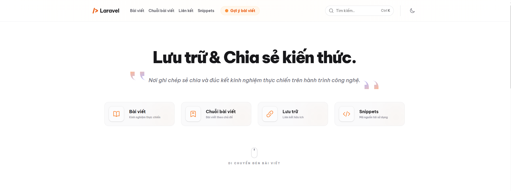
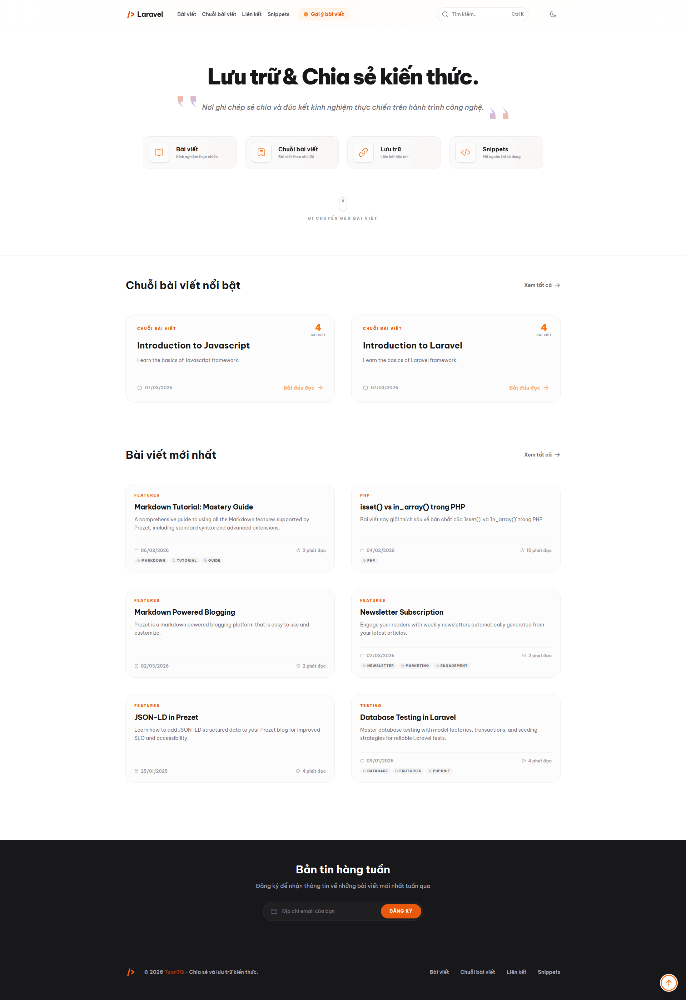

# Laradoc 📚

[](https://tuantq.online)
[](https://github.com/tqt97)
[](https://github.com/tqt97/laradoc)



Laradoc là một nền tảng quản lý kiến thức (Knowledge Base) và blog cá nhân hiện đại, được thiết kế để giúp các lập trình viên lưu trữ và chia sẻ kinh nghiệm một cách có hệ thống. Dự án tập trung vào việc viết và quản lý nội dung thông qua Markdown, kết hợp với sức mạnh của hệ sinh thái Laravel.

## 🚀 Công nghệ sử dụng

Dự án được xây dựng với các công nghệ hiện đại nhằm đảm bảo hiệu năng và khả năng mở rộng:

* **Backend**: [Laravel 12+](https://laravel.com) - PHP Framework mạnh mẽ.
* **Auth**: [Laravel Breeze](https://laravel.com/docs/11.x/starter-kits) - Hệ thống xác thực tối giản, hiện đại.
* **Engine**: [Prezet](https://prezet.com) - Thư viện quản lý nội dung Markdown cho Laravel.
* **Frontend**: [Tailwind CSS](https://tailwindcss.com) & [Blade](https://laravel.com/docs/blade) - Giao diện tùy biến, linh hoạt.
* **Markdown**: Hỗ trợ đầy đủ CommonMark, GitHub Flavored Markdown, và tích hợp Code Highlighting.

## 📸 Giao diện dự án



## ✨ Tính năng nổi bật

| Tính năng                                                                                                                 | Mô tả                                                                        |
| :------------------------------------------------------------------------------------------------------------------------ | :--------------------------------------------------------------------------- |
|  **Bài viết**     | Lưu trữ và chia sẻ kinh nghiệm thực chiến thông qua các bài viết chuyên sâu. |
|  **Chuỗi bài viết** | Tổ chức nội dung theo lộ trình học tập và chủ đề cụ thể.                     |
|  **Lưu trữ liên kết**  | Tổng hợp và phân loại các tài liệu, công cụ hữu ích từ internet.             |
|  **Ý tưởng**      | Đóng góp và quản lý các ý tưởng bài viết mới từ cộng đồng.                   |
|  **Snippets**          | Kho lưu trữ các đoạn mã nguồn ngắn, có thể tái sử dụng nhanh chóng.          |

## 🔐 Xác thực & Quản lý tài khoản (Laravel Breeze)

Dự án tích hợp **Laravel Breeze** để cung cấp hệ thống xác thực an toàn, tối giản và hiệu quả:

*   **Xác thực**: Hỗ trợ đầy đủ các tính năng Đăng ký, Đăng nhập, Quên mật khẩu và Xác nhận mật khẩu.
*   **Quản lý Profile**: Người dùng có thể cập nhật thông tin cá nhân (tên, email) và đổi mật khẩu trực tiếp qua giao diện UI.
*   **Bảo mật**: Tích hợp sẵn CSRF protection, xác thực email và các biện pháp bảo mật tiêu chuẩn của Laravel.
*   **Frontend**: Sử dụng Blade templates kết hợp với **AlpineJS** và **Tailwind CSS**, đảm bảo giao diện đồng nhất với toàn bộ dự án.

## 📝 Hướng dẫn quản lý nội dung

### 1. Nội dung dựa trên tệp (Articles, Series, Snippets)

Các nội dung này được quản lý thông qua các tệp `.md` trong thư mục `prezet/content/`. Mặc dù có thể tạo qua giao diện Web, các tệp này vẫn sẽ được lưu trữ trực tiếp vào mã nguồn.

#### Metadata cho Bài viết (Article)

Đặt tại `prezet/content/blogs/*.md`

```yaml
---
title: "Tiêu đề bài viết"
date: YYYY-MM-DD
excerpt: "Mô tả ngắn gọn về nội dung bài viết"
image: /prezet/img/ogimages/blogs-slug.webp
tags: [laravel, php, tutorial]
---

// Code của bạn ở đây
```

#### Metadata cho Chuỗi bài viết (Series)

Đặt tại `prezet/content/series/[folder-name]/index.md`

```yaml
---
title: "Tiêu đề Series hoặc Bài viết trong Series"
excerpt: "Mô tả ngắn gọn"
category: "Tên danh mục (vd: Laravel)"
date: YYYY-MM-DD
order: 1
image: /prezet/img/ogimages/series-slug-index.webp
---

// Code của bạn ở đây
```

#### Quản lý Snippets

Snippets có thể được tạo nhanh qua giao diện tại `/snippets/create`. Khi tạo qua Web, hệ thống sẽ sinh ra tệp `.md` tại `prezet/content/snippets/` với cấu trúc:

```yaml
---
title: "Tên Snippet"
excerpt: "Mô tả ngắn"
date: YYYY-MM-DD
category: snippets
language: php # Hoặc javascript, bash, v.v.
---

// Code của bạn ở đây

```

### 2. Nội dung dựa trên Database (Links, Ideas)

Quản lý trực tiếp thông qua giao diện người dùng (UI).

* **Links**: Thêm tại `/links`. Dùng để lưu trữ nhanh các liên kết tài liệu.
* **Ideas**: Đề xuất tại `/ideas`. Nơi cộng đồng gợi ý các chủ đề bài viết mới.

### 3. Tạo ảnh xem trước (OG Image)

Để bài viết có ảnh đại diện (Open Graph) chuyên nghiệp khi chia sẻ lên mạng xã hội, bạn nên tạo ảnh OG tương ứng.

* **Tạo tự động**: Sử dụng lệnh Artisan để chụp ảnh màn hình từ URL của bài viết:

    ```bash
    # Tạo cho một bài viết cụ thể
    php artisan prezet:ogimage [slug]

    # Tạo cho tất cả các bài viết chưa có ảnh
    php artisan prezet:ogimage --all
    ```

* **Vị trí lưu trữ**: Các ảnh được tạo sẽ được lưu tại thư mục: `prezet/images/ogimages/`.
* **Quy tắc đặt tên**: Tên tệp ảnh nên trùng với slug của nội dung để dễ quản lý.
* **Khai báo trong Frontmatter**: Sau khi tạo ảnh, hãy cập nhật đường dẫn vào metadata:

    ```yaml
    image: /prezet/img/ogimages/your-slug.webp
    ```

### 4. Đồng bộ ý tưởng và Thông báo (Idea Sync & Notifications)

Khi bạn viết bài dựa trên ý tưởng từ cộng đồng, hệ thống có thể tự động gửi email thông báo cho người đề xuất.

* **Liên kết ý tưởng**: Khi tạo bài viết mới bằng lệnh `php artisan prezet:make`, hãy chọn "Yes" khi được hỏi về việc liên kết với ý tưởng hiện có.
* **Cập nhật trạng thái và Gửi mail**: Sau khi hoàn thành nội dung bài viết, hãy chạy lệnh sau để đồng bộ trạng thái ý tưởng sang "Đã đăng" và tự động gửi email thông báo (queued):

    ```bash
    # Cách 1: Chạy lệnh tổng hợp (Khuyên dùng - bao gồm prezet:index)
    composer prezet-index

    # Cách 2: Chỉ chạy lệnh đồng bộ ý tưởng
    php artisan idea:sync-published
    ```

* **Lưu ý**: Đảm bảo Queue Worker đang chạy (`php artisan queue:work`) để email được gửi đi thành công.

---

## 🤝 Hướng dẫn đóng góp (Contributing)

### Quy trình đóng góp

1. **Fork** dự án về tài khoản của bạn.
2. Tạo một **Branch** mới (`git checkout -b feature/amazing-content`).
3. **Commit** thay đổi và **Push** lên Branch của bạn.
4. Mở một **Pull Request (PR)** hướng về nhánh `master` của repository gốc.

### Quy trình phê duyệt

- Vui lòng chờ đợi chủ sở hữu repository ([tqt97](https://github.com/tqt97)) kiểm tra và đánh giá.
* PR sẽ được merge sau khi đạt yêu cầu về nội dung và kỹ thuật.

## 📬 Liên hệ

* **Tác giả**: [tqt97](https://github.com/tqt97)
* **Repository**: [tqt97/laradoc](https://github.com/tqt97/laradoc)
* **Email**: [kutuanonline199@gmail.com](mailto:kutuanonline199@gmail.com)
* **Website**: [tuantq.online](https://tuantq.online)

---
*Cảm ơn bạn đã tham gia xây dựng cộng đồng Laradoc!*
